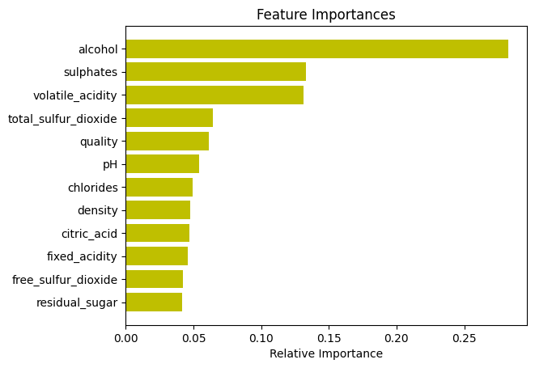

# DATA
The dataset is composed of 1153 samples wine with 12 features each. The features are:
- fixed acidity
- volatile acidity
- citric acid
- residual sugar
- chlorides
- free sulfur dioxide
- total sulfur dioxide
- density
- pH
- sulphates
- alcohol
- quality (score between 0 and 10)

Each wine has a unique Id in the dataset.
# MODELS
The models used are:
- Random Forest Classifier (RFC) with 300 estimators, trained on the whole dataset resampled with SMOTE to balance the classes.


# APP SETUP
## Requirements
- A version of Python 3.8 or higher
- A version of pip 20.2 or higher

## Setup
- Clone the repository
- Create a virtual environment with the following command:
```
virtualenv -p python3 venv
```
- Activate the virtual environment with the following command:
```
source venv/bin/activate
```
- Install the requirements with the following command:
```
pip install -r requirements.txt
```

# APP USAGE
- Go to the app folder with the following command:
```
cd app
```
- Run the app with the following command:
```
uvicorn main:app --reload
```
- The app default to the following url:
```
127.0.0.1:8000
```
- You can access the documentation of the API at the followings url:
```
127.0.0.1:800/docs
127.0.0.1:800/redoc
```
## Listing of the endpoints
### Wines
- GET api/wines
    - Get all the wines from the dataset
- GET api/wines/{wine_id}
    - Get a specific wine from the dataset
- POST api/wines
    - Add a new wine to the dataset
- DELETE api/wines/{wine_id}
    - Delete a specific wine from the dataset

### Model
- GET api/model
    - Get the model used to predict the quality of the wine
- PUT api/model
    - Update the model used to predict the quality of the wine by adding a new wine to the dataset
- GET api/model/description
    - Get various information about the model used to predict the quality of the wine, like the metrics (see below) of the last training, the hyperparameters of the model, and informations related to the model object.
- POST api/model/retrain
    - Retrain the model used to predict the quality of the wine, save the model and the metrics of the training

### Predictions
- GET api/predict
    - Return the features of the best wine possible based on predefined criteria (see below)
- POST api/predict
    - Predict the quality of a given wine using the model


# TECHNICAL CHOICES
- Traget transformation: 
    - the target is transformed into a binary variable ("bad" or "good") to predict if the wine is good or not. The threshold is set to 7, which means that the wine is good if the quality is higher than 7.
    We made this choice because we wanted to have a balanced dataset to train the model. Indeed, the dataset is unbalanced, with 983 wines with a quality lower than 7 and 159 wines with a quality higher than 7.
   
- Model selection:
    - The model is a Random Forest Classifier (RFC) with 300 estimators, trained on the whole dataset resampled with SMOTE to balance the classes.
    We made this choice because we wanted to have a model that is easy to train and to interpret. Indeed, the RFC is a model that is easy to train and to interpret. Moreover, it is a model that is robust to outliers and to unbalanced dataset. Finally, it is a model that is not sensitive to the scale of the features. It was trained using GridSearchCV to find the best parameters.

- Model evaluation:
    - The model is evaluated using : 
        - the accuracy score, which is the ratio of the number of correct predictions to the total number of predictions.
        - the precision score, which is the ratio of the number of correct positive predictions to the total number of positive predictions.
        - the recall score, which is the ratio of the number of correct positive predictions to the total number of positive samples.
        - the f1 score, which is the harmonic mean of the precision and recall scores.

- Best Wine selection:
    - The best wine is selected using the following criteria:
        - the wine is good (quality > 7)
        - the wine has the highest level of alcohol of all the good wines. We made this choice because the data analysis showed that the alcohol level is a good indicator of the quality of the wine. We can verify this assumption by looking at the correlation between the alcohol level and the quality on the following graph:
        <p align="center" width="100%">
            
        </p>
